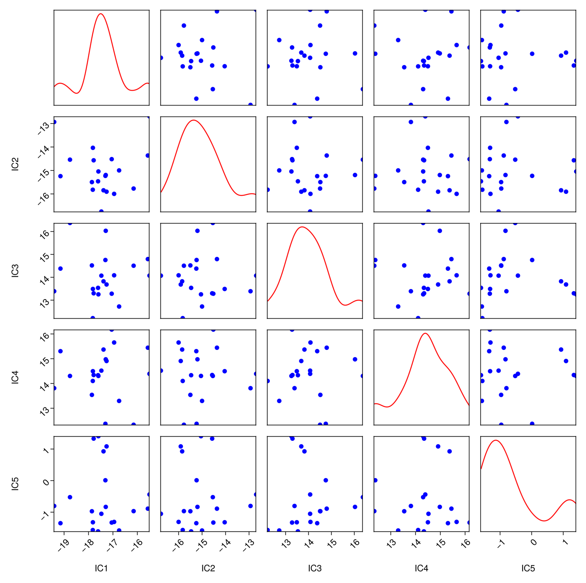
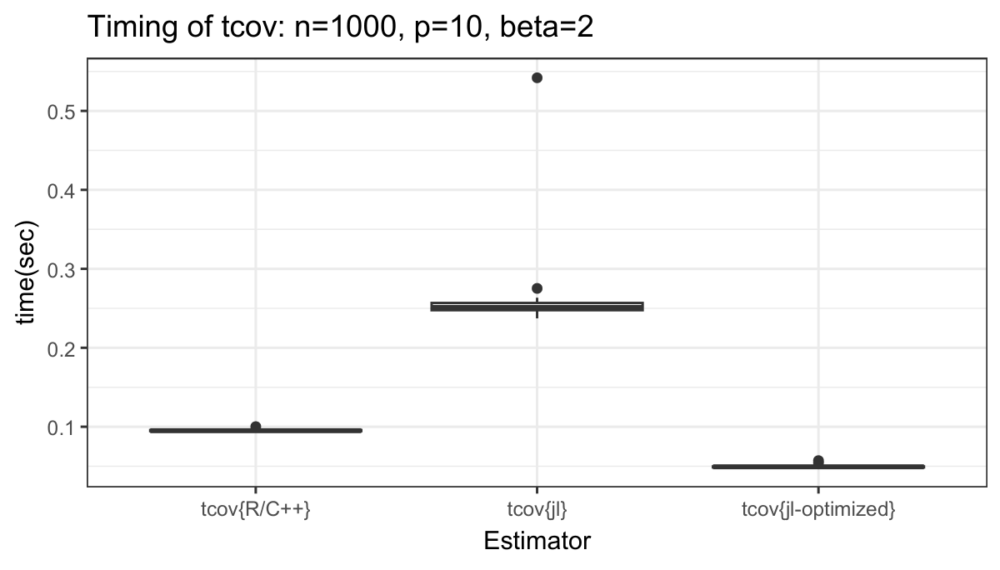
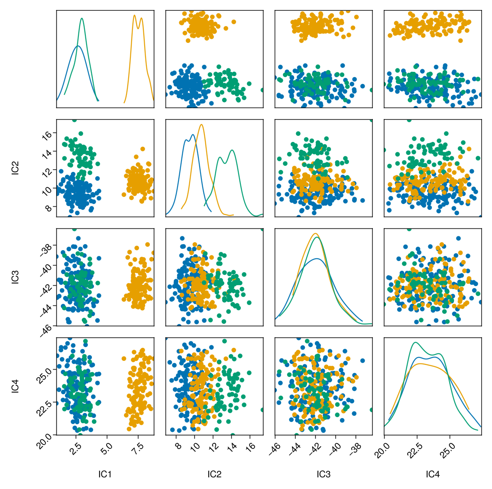
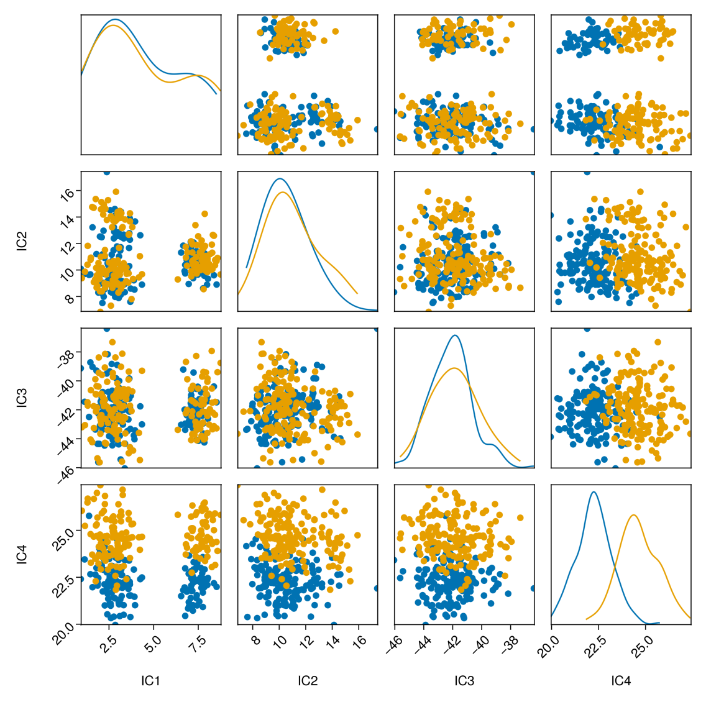
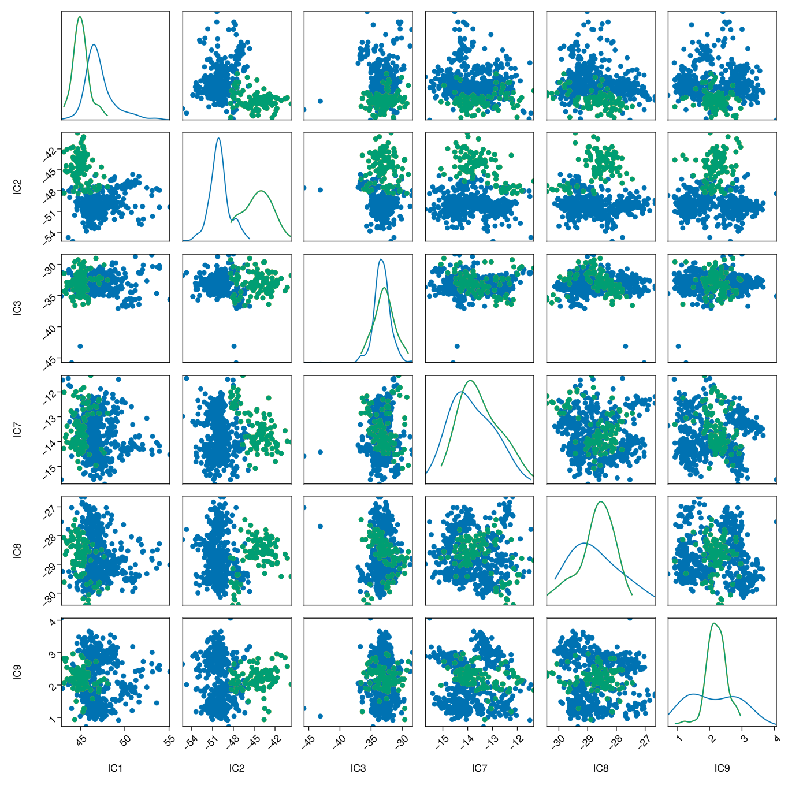
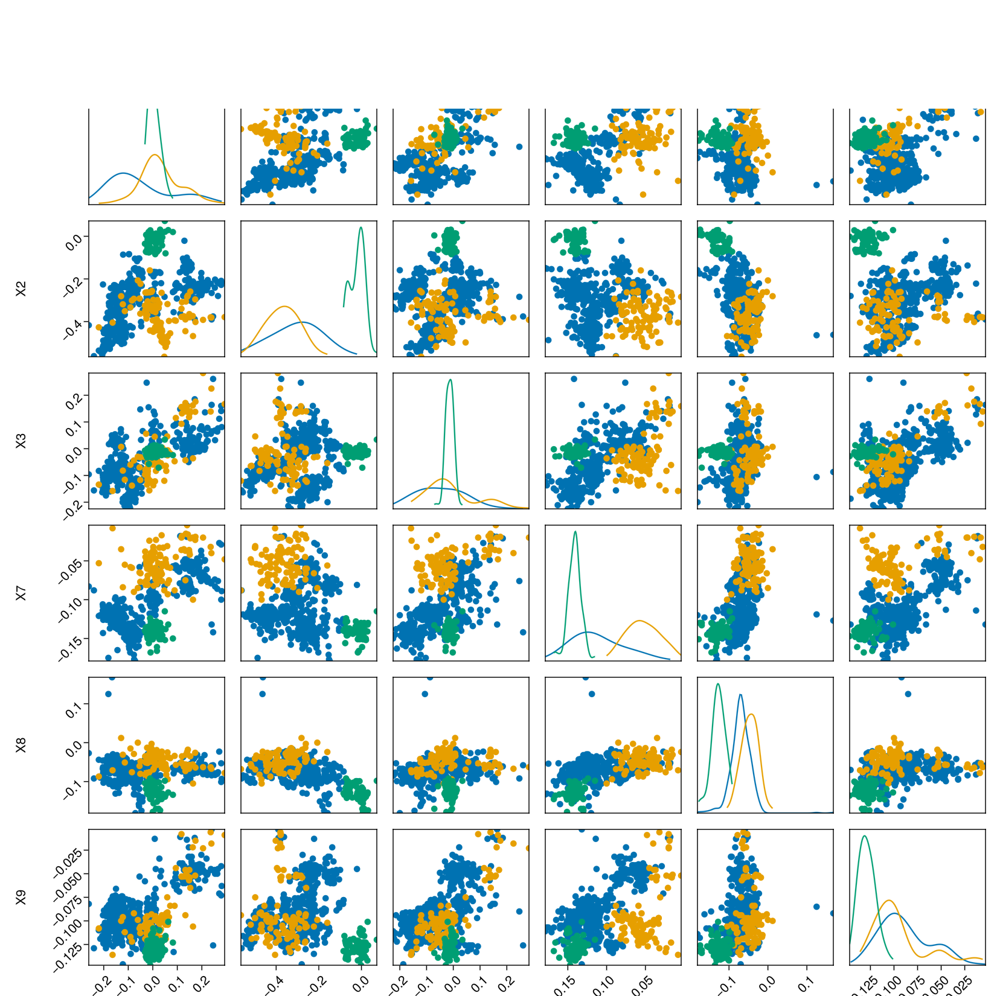
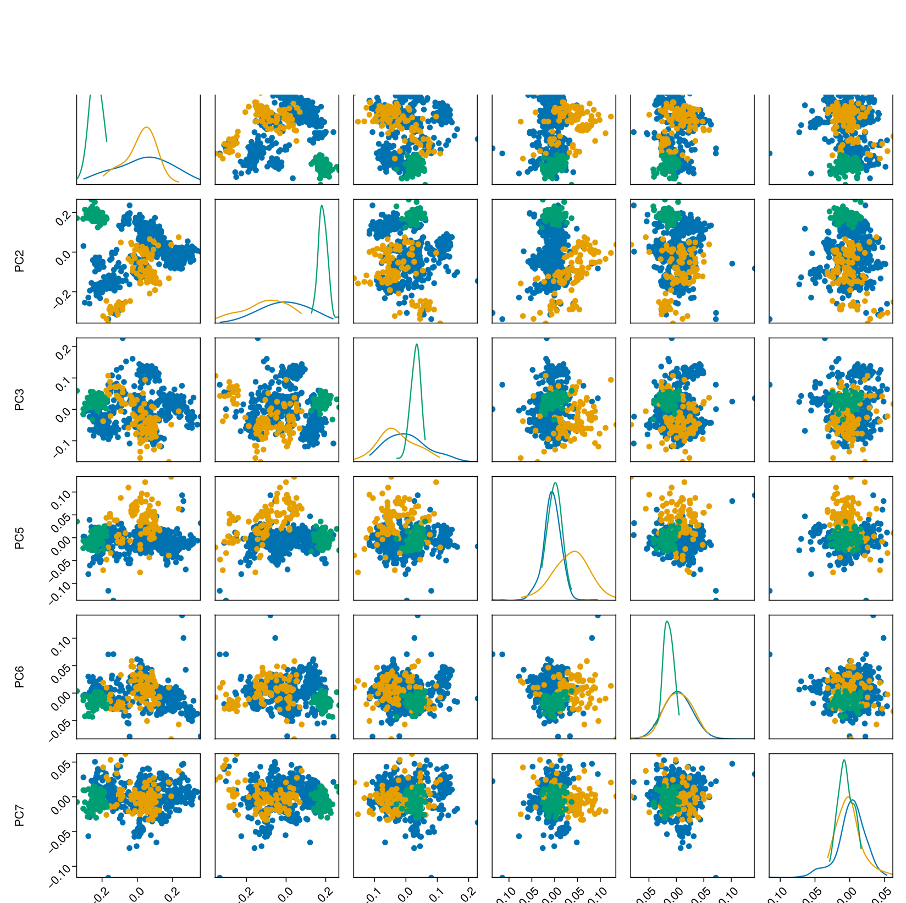

```{r setup, include=FALSE}
knitr::knit_hooks$set(purl = knitr::hook_purl)
knitr::opts_chunk$set(echo = TRUE, eval = TRUE)
library(JuliaCall)
julia_setup()
```

## Introduction

Invariant Coordinate Selection (ICS) is an unsupervised multivariate statistical method used for dimension reduction, outlier detection, and cluster identification. By simultaneously diagonalizing two different scatter matrices, ICS projects high-dimensional data into a new, meaningful coordinate system to easily uncover underlying structures.
It is particularly useful for dimension reduction. Unlike PCA, ICS is not based on variance maximization but on the maximization/minimization of a generalized kurtosis, and it is invariant not only to orthogonal data transformations but also to any affine transformation.

The ```Julia``` ```ICSTools``` package brings the main functionalities of the ```R``` ```ICS``` package to ```Julia```, offering tools for identifying and selecting invariant coordinates in multivariate data. It includes various covariance estimators, transformation settings, and plotting utilities. Our extensive testing ensures results consistent with the ``R``` package, making it easy for users to transition from ```R``` to ```Julia``` or start fresh with ```ICS```.

The source code of this project is available at our GitHub Repository:  [ICSTools](https://github.com/valentint/ICSTools.jl). 
The complete documentation of the API with examples can be found at [```ICSTools``` Documentation](https://valentint.github.io/ICSTools.jl/dev/). 

The results of the test coverage are available at 
[```ICSTools``` Tests](https://app.codecov.io/github/valentint/ICSTools.jl?branch=main).


```{julia install-packages, results='hide', eval=FALSE}
import Pkg;
Pkg.add("Robustbase"); using Robustbase
Pkg.add("ICSTools"); using ICSTools
Pkg.add("Plots"); using Plots
Pkg.add("DataFrames"); using DataFrames
Pkg.add("GLMakie"); using GLMakie       # for pairplots() and related
Pkg.add("PairPlots"); using PairPlots   # for pairplots() and related
Pkg.add("RCall"); using RCall           # To access R data sets; to perform tests
Pkg.add("Clustering"); using Clustering # for kmeans() and randindex()
Pkg.add("Test"); using Testing          # for testing against R
Pkg.add("BenchmarkTools"); using BenchmarkTools # for benchmarking scatter functions
Pkg.add("Random");Random                # for testing and benchmarking
```


## Getting started
```{julia load-data}
using ICSTools

# Load dataset
using Robustbase
X=wood[:,1:5];
```

```{julia instantiate-model}
## Instantiate ICSModel object with all default parameters
ics = ICSModel();
show(ics)
```

```{julia instantiate-alternatives, eval=FALSE}
## Alternative instantiations: 

## 1. With values for S1 and S2
ics1 = ICSModel(S1=cov2, S2=cov4);

## 2. With arguments for S2
ics2 = ICSModel(S1=cov2, S2=covW, S2_args=Dict{Symbol, Any}(:alpha=>1, :cf=>2));

## 3. With algorithm
ics3 = ICSModel(S1=cov2, S2=covW, algorithm="standard");
```

```{julia fit-model}
## Fit the ICS model - equivalent of the function ICS-S3() from the R package ICS
ICSTools.fit!(ics, X);
show(ics)
```

```{julia predict}
## Predict using the fitted model
scores=predict(ics, X);
scores
```

The following example illustrates how to plot the transformed/predicted data (invariant components) using ```component_plot2()``` and the kurtosis of the invariant components (corresponding to the eigenvalues of the joint diagonalization problem) using ```scree_plot()```.

```{julia plots}
## scree plot and 2-dimensional component plot
using Plots
gr()
scree_plot(ics)
component_plot2(ics)                # by default the first two components
component_plot2(ics, select=[3,4])  # select components 3 and 4
```

```{julia plots2}
using DataFrames
using GLMakie
using PairPlots
ss = DataFrame(scores, ["IC$i" for i=1:size(scores,2)]);
fig = pairplot(ss, fullgrid=true);

fig = pairplot(
    ss => (PairPlots.Scatter(markersize=10, color=:blue),
          PairPlots.MarginDensity(color=:red)), 
          fullgrid=true
)

save("images/wood-scores.png", fig)
```


## The scatters
ICS is based on  simultaneously diagonalizing two different scatter matrices. The ICSTools package contains a number of implementations of scatter matrices, almost all scatters that are available in the different packages in ```R```.
Each scatter function takes a data matrix or a data frame and returns a structure with the following fields:

* (optional) location

* scatter matrix

* label


```{julia show-function, echo=FALSE, results='hide'}

## This is workaround for the errors in the show function for scatter
##in the current version of ICSTools

using ICSTools

function Base.show(io::IO, mime::MIME"text/plain", obj::ICSTools.Scatter)
    #   you can add IO options if you want
    #multiline = get(io, :multiline, true)
    #print_object(io, obj, multiline = multiline)

    println(io, "-> Scatter: " , obj.label)
    
    if !isnothing(obj.location)
        println(io, "Location:")
        println(IOContext(io, :compact=>true), obj.location)
    end

    println(io)
    println(io, "Scatter:")
    Base.show(io, mime, obj.scatter)
end
```

```{julia cov4}
using ICSTools

# Load dataset
using Robustbase
X=wood[:,1:5];

cov4(X)
```

Some scatter functions can take optional arguments. All functions are implemented in the ```ICSTools``` package, ```mcd_raw()``` and ```mcd_rew()``` use the Julia package ```Robustbase``` for the implementation of the FASTMCD algorithm.

```{julia covW}
covW(X, alpha=2, cf=4)
```

When scatter functions are used as arguments to ```ICSModel()```, the optional arguments can be passed as data dictionaries:

```{julia ICSModel, eval=FALSE}
ics1 = ICSModel(S1=cov2, S2=covW, S2_args=Dict{Symbol, Any}(:alpha=>2, :cf=>4));

ics2 = ICSModel(S1=mcd_raw, S2=cov2, S1_args=Dict{Symbol, Any}(:nsamp=>1000, :alpha=>0.75));
```

Table 1. List of scatter functions implemented in the ```Julia```package ```ICSTool```.

|      | Function | Location | Optional parameters |
| :--- | :---: | :---: |:--- |
| Covariance | ```cov2``` | Yes | - |
| Fourth-moment covariance | ```cov4``` | Yes | -  | 
| One-step M-estimator | ```covW``` | Yes | ```alpha```, ```cf``` |
| One-step Tyler shape matrix | ```covAxis``` | Yes | - |
| Multivariate t-distribution estimator | ```tM```  | Yes | ```alg```, ```mu_init```, ```V_init```, ```gamma_init```, ```eps```, ```maxiter``` |
| Cauchy location and scatter           | ```mlc``` | Yes | ```alg```, ```mu_init```, ```V_init```, ```gamma_init```, ```eps```, ```maxiter``` |
| Raw MCD        | ```mcd_raw``` | Yes | ```alpha```,```nsamp``` |
| Reweighted MCD | ```mcd_rwt``` | Yes | ```alpha```, ```nsamp``` |
| Pairwise one-step M-estimate | ```tcov``` | No | ```beta``` |
| Local shape scatter | ```lcov``` | No | ```proportion```, ```mscatter```, ```mcdalpha```, ```covstandard``` |

### Testing against ```R```

Since all scatter functions are also available in several different ```R``` Packages we can conveniently test the by running the ```R``` code comparing the results. An example is given below.

```{julia test, results='hide', eval=FALSE}
using DataFrames
using RCall
using Test

## Load R libraries 
R"library(ICSOutlier)";
R"library(ICSClust)";

cc=R"ICS_cov4($X, location='mean')";    # call cov4() in R
ss=cov4(X);                             # call cov4() in Julia
```

```{julia test-compare, eval=FALSE}
## Compare the returned labels, locations and scatters
@test(ss.label == rcopy(cc)[Symbol("label")])
@test(isapprox(ss.location, rcopy(cc)[Symbol("location")]))
@test(isapprox(ss.scatter, rcopy(cc)[Symbol("scatter")]))
```

### Benchmarking

One of the main advantages of Julia``` is the so called solving of the "two languages problem", i.e. in order to achive satifactury computational speed in ```R``` or ```Python``` it is necessary t program critical parts of the code in a native compiled languages like ```C``` or ```C++```.This is not neessary in ```Julia`` - everything is written in the same language.
A good example for this is the scatter function ```tcov()``` which in ```R``` is written in ```C++```. To illustrate this we will benchmark this functions.

```{julia benchmark}
using BenchmarkTools
using ICSTools
using Random

X = rand(1000, 10);

bb1 = @benchmark tcov(X) samples=19;
bb1

```

The following graph presents the timing of two versions of the function ```tcov()``` in ```Julia```, the first is straightforward translation of the ```C++``` code in the ```R``` package ```ICSClust```, the second is optimized for ```Julia```.




## Example applications

### The Penguins data set


Data on adult penguins covering three species found on three islands in the Palmer Archipelago, Antarctica, including their size (flipper length, body mass, bill dimensions), and sex.  The data set ```penguins``` in ```R``` is a data frame with 344 rows and 8 variables. It is also available in ```Julia``` as a package ```PalmerPenguins.jl```.

Be careful there are missing values so we could consider only 342 observations. However, there are further 9 observations for which the variable ```sex``` has ```NA```, therefore it is better to work with the remaining 333 observations.

The idea of the penguins data set is to replace the well known ```iris``` data set which is used throughout data science, education statistical software and machine learning as test and illustration data set. The structure of ```penguins``` is similar to that of ```iris``` but still there are several essential differences: There are several grouping variables (species, island, sex and year), the sample sizes of the groups (152-68-124) are not equal as in iris (3x50), there are a few observations with missing values.

Table 1. Sample sizes for ```iris``` and ```penguins```. Data in penguins can be further grouped by island and study year.

| Iris species | Sample size | Penguin species | Female | Male | NA |
| :--- | :---:  | :--- | :---:  | :---: | :---:  |
| setosa | 50 | Adélie | 73 | 73 | 6 |
| versicolor | 50 | Chinstrap | 34 | 34 | 0 |
| virginica | 50 | Gentoo | 58 | 61 | 5 |

We start by downloading the data set from ```R```:

```{julia penguins-load, results='hide'}
## Load the penguins data from R
using DataFrames
using RCall
Robj = R"data('penguins', package='datasets'); x=penguins";

## Copy the contents of an R object into a corresponding canonical Julia type       
penguins = rcopy(Robj);
size(penguins)
penguins = dropmissing(penguins); # drop the missing values
size(penguins)
X = penguins[:,3:6];              # select only the quantitative variables
```

```{julia penguins-tabulate}
## Tabulate species by sex
gdf = groupby(penguins, [:species, :sex]);
tt = combine(gdf, nrow);
show(IOContext(stdout, :limit=>false), MIME"text/plain"(), tt)
```
Now we apply ICS with scaters ```tcov``` and ```cov2```, transform the model using the penguin data and plot the ```scree_plot``` (analogue to eigenvalues screeplot in PCA).

```{julia penguins-ICS, resutlts='hide'}
using ICSTools
ics = ICSModel(S1=tcov, S2=cov2);
scores = fit_predict!(ics, X);
```

```{julia penguins-ICS-screeplot}
using Plots
gr()
scree_plot(ics)
```

For convineance, to look at the data taking the grouping by species and by sex into account we convert the categorical arrays into string arrays.

```{julia penguins-grouping}
## Convert the categorical arrays species and sex to string arrays
using CategoricalArrays
species = unwrap.(penguins.species);
sex = unwrap.(penguins.sex);
```

Then we plot the first two IC components grouping the data by species (the different colours represent the different species). We see that the species are very well separated.
```{julia penguins-plot-species}
## Convert the categorical arrays species and sex to string arrays
component_plot2(ics, clusters=species)
```

Next, we plot the fourth IC component grouping the data by sex . We see that the sex of the penguins is very well separated on the fourth IC.
```{julia penguins-plot-sex}
## Convert the categorical arrays species and sex to string arrays
component_plot2(ics, clusters=sex, select=[4])
```

Finally, we look at the pair plots of the IC scores of the penguins data. 
This function (```component_plot()```) is not implemented in the ```ICSTools``` package, therefore we call directly the ```pairplot()``` function. The grouping is by species.
```{julia penguins-pairplots}
using DataFrames
using GLMakie
using PairPlots

ss = DataFrame(scores, ["IC$i" for i=1:size(scores,2)]);

fig=pairplot(ss[species .== "Adelie", :] => 
             (PairPlots.Scatter(markersize=10),
              PairPlots.MarginDensity()), 
            ss[species .== "Gentoo", :] =>
             (PairPlots.Scatter(markersize=10),
              PairPlots.MarginDensity()), 
            ss[species .== "Chinstrap", :] =>
             (PairPlots.Scatter(markersize=10),
              PairPlots.MarginDensity()), 
          fullgrid=true)
save("images/penguins-plot-species.png", fig)
```


Now we repeat the same with grouping by sex.
```{julia penguins-pairplots-sex}
fig=pairplot(ss[sex .== "female", :] => 
             (PairPlots.Scatter(markersize=10),
              PairPlots.MarginDensity()), 
            ss[sex .== "male", :] =>
             (PairPlots.Scatter(markersize=10),
              PairPlots.MarginDensity()), 
          fullgrid=true)
save("images/penguins-plot-sex.png", fig)
```
 

### Cluster analysis

The Philips data set was first introduced in the robustness
literature in Rousseeuw and Van Driessen (1999) as a motivation
example for developing the FASTMCD algorithm.
Later it was used as an example in a number of papers and
presentations (Maronna and Zamar, 2002; Willems et al., 2009).

The data set is available in the ```R``` package ```cellWise```. For each of ```n = 677``` 
parts (metal plates molded by a press) ```p = 9``` characteristics were measured.
The aim of the multivariate analysis was to gain insight in the
interrelations between the variables and to investigate if any
deformations or abnormalities have occurred during the
production process.
There are two groups of outliers (as analyzed by the Philips engineers and demosntrated by Rousseeuw et al. (1999):
the first 100 observations and the 75 observations with indexes 491 to 565. The thirsd group are the 502 regular observations. 

We start by downloading the Philips data set from ```R```:

```{julia philips-load, results='hide'}
## Load the penguins data from R
using DataFrames
using RCall
RObj = R"data('data_philips', package='cellWise'); x=data_philips";

## Copy the contents of an R object into a corresponding canonical Julia type        
X = rcopy(RObj)
size(X)

## Define the clusters
clusters = repeat(["Group1"], outer=size(X, 1))
clusters[1:100] .= "Group2"
clusters[491:565] .= "Group3"

## We will use these to validate the k-means
true_labels = fill(1, size(X, 1))
true_labels[1:100] .= 2
true_labels[491:565] .= 3
```

Now we apply ICS with scaters ```mcd_raw``` and ```cov2```, transform the model using the Philips data and plot the ```scree_plot``` (analogue to eigenvalues scree plot in PCA).
```{julia philips-model}
using ICSTools
ics = ICSModel(S1=mcd_raw, S2=cov2);
scores = fit_predict!(ics, X);

using Plots
gr()
scree_plot(ics)
```

Show the clusters in the first two ICs
```{julia philips-clusters}
component_plot2(ics, clusters=clusters)
```

Show the pair plots of the first 3 and the last three ICs.
```{julia philips-pairs, eval=FALSE}
using DataFrames
using GLMakie
using PairPlots

ss = DataFrame(scores[:,[1, 2, 3, 7, 8, 9]], ["IC$i" for i=[1, 2, 3, 7, 8, 9]]);
ss_raw = DataFrame(X[:,[1, 2, 3, 7, 8, 9]], ["X$i" for i=[1, 2, 3, 7, 8, 9]]);

fig=pairplot(ss[clusters .== "Group1", :] => 
             (PairPlots.Scatter(markersize=10),
              PairPlots.MarginDensity()), 
            ss[clusters .== "Group2", :] =>
             (PairPlots.Scatter(markersize=10),
              PairPlots.MarginDensity()), 
            ss[clusters .== "Group3", :] =>
             (PairPlots.Scatter(markersize=10),
              PairPlots.MarginDensity()), 
          fullgrid=true)
save("images/philips-pairs.png", fig)
```



Now show the pair plots of the original data. We cannot observe any structure.
```{julia philips-pairs-raw, eval=FALSE}
fig_raw=pairplot(ss_raw[clusters .== "Group1", :] => 
             (PairPlots.Scatter(markersize=10),
              PairPlots.MarginDensity()), 
            ss_raw[clusters .== "Group2", :] =>
             (PairPlots.Scatter(markersize=10),
              PairPlots.MarginDensity()), 
            ss_raw[clusters .== "Group3", :] =>
             (PairPlots.Scatter(markersize=10),
              PairPlots.MarginDensity()), 
          fullgrid=true)
save("images/philips-raw.png", fig_raw)
```


Next, let us look at the PCA. Again there is no visible structure.
```{julia philips-pairs-pca, eval=FALSE}
using MultivariateStats
Xtr=Matrix(X)'
M = fit(PCA, Xtr; maxoutdim=9)
Ytr = MultivariateStats.predict(M, Xtr)'
ss_pca = DataFrame(Ytr[:,[1, 2, 3, 5, 6, 7]], ["PC$i" for i=[1, 2, 3, 5, 6, 7]]);

fig_pca=pairplot(ss_pca[clusters .== "Group1", :] => 
             (PairPlots.Scatter(markersize=10),
              PairPlots.MarginDensity()), 
            ss_pca[clusters .== "Group2", :] =>
             (PairPlots.Scatter(markersize=10),
              PairPlots.MarginDensity()), 
            ss_pca[clusters .== "Group3", :] =>
             (PairPlots.Scatter(markersize=10),
              PairPlots.MarginDensity()), 
          fullgrid=true)
save("images/philips-pairs_pca.png", fig_pca)
```



Now let us turn the exploratory observations on the three pair plots to more concrete numbers. We can run k-means clustering on the raw data, the (first 3) PCA scores and the (first 3) ICs. Since we know the true clusters, we can compute a suitable external validation measure like the Adjusted Rand index and compare them.

```{julia philips-ari, results='hide'}
## 1. Do k-means on the raw data
using Clustering
result = kmeans(X', 3);
ri, ari_raw = randindex(result.assignments, true_labels);
ari_raw

## Do k-means on the first 3 ICs
using Clustering
Y=scores[:,1:3];
result_ICS = kmeans(Y', 3);
ri, ari_ICS = randindex(result_ICS.assignments, true_labels);
ari_ICS

##  Do k-means on the first 3 PCs
using MultivariateStats
using Clustering
Xtr=Matrix(X)';
M = fit(PCA, Xtr; maxoutdim=9);
Ytr = MultivariateStats.predict(M, Xtr)';
Ytr3 = Ytr[:,1:3]';
result_PCA = kmeans(Ytr3, 3);
ri, ari_PCA = randindex(result_PCA.assignments, true_labels);
ari_PCA
```

```{julia philips-ari-show}
println("ari_raw:\t\t", ari_raw, "\nari_PCA_3:\t", ari_PCA, "\nari_ICS_3:\t", ari_ICS)
```


## Julia packages: Technical issues

### Documentation

### Testing

### Built-in data sets


