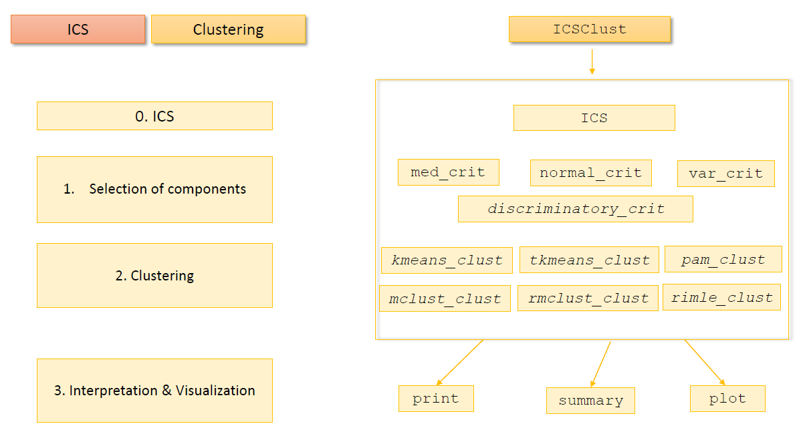
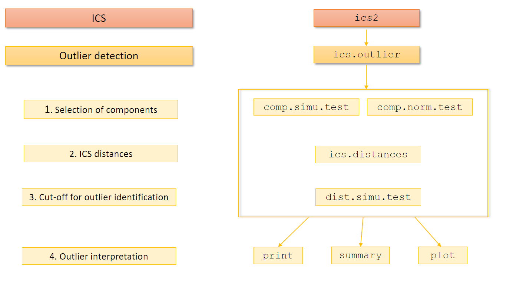
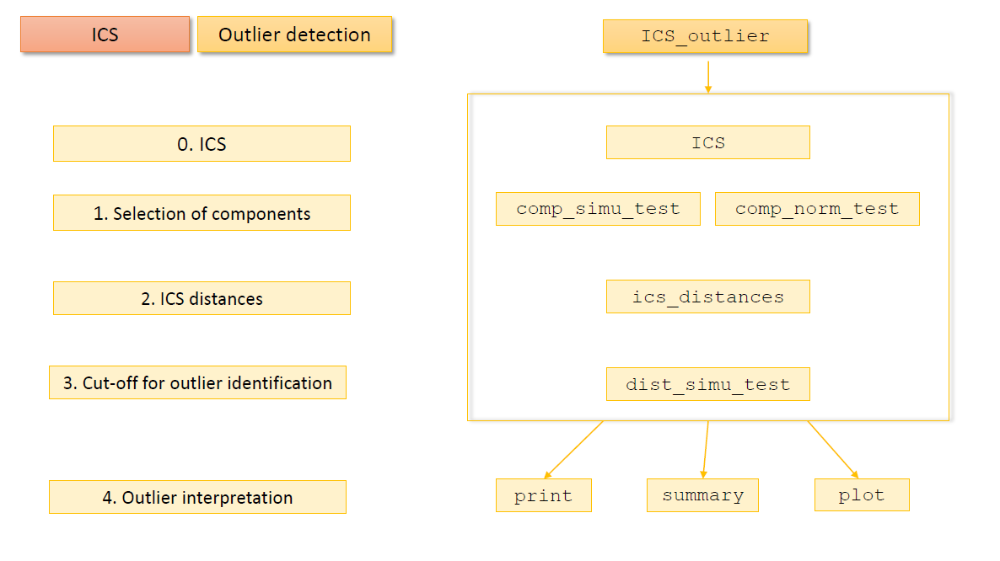

```{r setup, include=FALSE}
knitr::opts_chunk$set(echo = TRUE, eval = FALSE)
```

## Objectives

This is a guided tour of ICS implementations in R based on the main
packages:

-   [ICS](https://cran.r-project.org/web/packages/ICS/index.html) -
    Nordhausen, K., Alfons, A., Archimbaud, A., Oja, H., Ruiz-Gazen, A.
    and Tyler, D. E. (2023). R package version 1.4-2.

-   [ICtest](https://CRAN.R-project.org/package=ICtest) - Nordhausen K,
    Oja H, Tyler D, Virta J (2022). ICtest: Estimating and Testing the
    Number of Interesting Components in Linear Dimension Reduction. R
    package version 0.3-5.

-   [ICSClust](https://cran.r-project.org/web/packages/ICSClust/index.html) -
    Archimbaud, A., Alfons, A., Nordhausen, K., and Ruiz-Gazen, A.
    (2023a). ICSClust: Tandem Clustering with Invariant Coordinate
    Selection. R package version 0.1.0.

-   [ICSOutlier](https://cran.r-project.org/web/packages/ICSOutlier/index.html) -
    Archimbaud A, Nordhausen K, Ruiz-Gazen A (2016). ICSOutlier: Outlier
    Detection Using Invariant Coordinate Selection. R package version
    0.4-0.

-   [ICSShiny](https://CRAN.R-project.org/package=ICSShiny) - Archimbaud
    A, May J, Nordhausen K, Ruiz-Gazen A (2017). ICSShiny: ICS via a
    Shiny Application. R package version 0.6.

> Please install the following packages

```{r, libs, message = FALSE}
library(ICS)
library(ICSOutlier)
library(ICSShiny)
library(ICSClust)
```

## ICS for dimension reduction

### A reminder

*Main attributes*

| Description                                                                                                                                             | R - `ics()` , `ics2()` | R - `ICS()`                       | Python |
|--------------------|-----------------|-----------------|-----------------|
| Generalized eigenvalues                                                                                                                                 | `@gKurt`               | `$gen_kurtosis`, `gen_kurtosis()` |        |
| Unmixing matrix or a numeric matrix in which each row contains the coefficients of the linear transformation to the corresponding invariant coordinate. | `@UnMix`               | `$W`                              |        |
| Scores                                                                                                                                                  | `@Scores`              | `$scores`, `components()`         |        |

*Methods*

| Description                  | R - `ics()` , `ics2()` | R - `ICS()`                            | Python |
|------------------|------------------|-------------------|------------------|
| Print basic information      |                        | `print()`                              |        |
| Coefficient matrix of ICS    |                        | `coef()`                               |        |
| Summary                      |                        | `summary()`                            |        |
| Component scatterplot matrix |                        | `plot()`, `ICSClust::component_plot()` |        |
| Plots the kurtosis measures  |                        | `screeplot()`, `ICS::select_plot()`    |        |

### Default values

> Run `ICS` by default on `iris` data set.

```{r, ICS}
out_ICS <- try(ICS(iris))
X <- iris[,-5]
out_ICS <- ICS(X)
out_ICS
```

> You can try the different methods: `print`, `coef`, `summary`, `plot`,
> `fitted`.

```{r, ICS_methods}
summary(out_ICS)
plot(out_ICS)
coef(out_ICS)
head(fitted(out_ICS))
```

> Try to access the main attributes.

```{r, ICS_attributes}
# Generalized eigenvalues
out_ICS$gen_kurtosis
gen_kurtosis(out_ICS)
screeplot(out_ICS, type = "bar")
screeplot(out_ICS, type = "line")
select_plot(out_ICS)

# Extract the component OR scores
head(out_ICS$scores)
head(components(out_ICS))
head(components(out_ICS, select = 1:2))
```

### Different scatter pair

| Scatters                              | R - Scatter        | R - `ICS_scatter`                          | Python |
|------------------|------------------|-------------------|------------------|
| Covariance                            | `ICS::cov()`       | `ICS::ICS_cov()`                           |        |
| Fourth-moment covariance              | `ICS::cov4()`      | `ICS::ICS_cov4()`                          |        |
| One-step M-estimator                  | `ICS::covW()`      | `ICS::ICS_covW()`                          |        |
| One-step Tyler shape matrix           | `ICS::covAxis()`   | `ICS::ICS_covAxis()`                       |        |
| Multivariate t-distribution estimator | `ICS::tM()`        | `ICS::ICS_tM()`                            |        |
| Supervised scatter (quantiles)        | `ICS::scovq()`     | `ICS::ICS_scovq()`                         |        |
| Minimum Covariance Determinant (MCD)  | `rrcov::CovMcd()`  | `ICSClust::ICS_mcd_raw()`, `ICS_mcd_rwt()` |        |
| Cauchy location and scatter           | `ICS::tM()`        | `ICSClust::ICS_mlc()`                      |        |
| Pairwise one-step M-estimate          | `ICSClust::tcov()` | `ICSClust::ICS_tcov()`                     |        |
| Simple robust estimates               | `ICSClust::ucov()` | `ICSClust::ICS_ucov()`                     |        |
| Local shape scatter                   | `ICSClust::lcov()` | `ICSClust::ICS_lcov()`                     |        |

```{r, scatters}
# By default - COV-COV4
out_ICS <- ICS(X, S1 = ICS_cov, S2 = ICS_cov4)
out_ICS
component_plot(out_ICS, clusters = iris$Species)

# MCD0.50-COV
out_ICS_mcd <- ICS(X, S1 = ICS_mcd_raw, S2 = ICS_cov)
out_ICS_mcd
component_plot(out_ICS_mcd, clusters = iris$Species)

# MCD0.25-COV
out_ICS_mcd <- ICS(X, S1 = ICS_mcd_raw, S2 = ICS_cov, S1_args = list(alpha = 0.25))
out_ICS_mcd
component_plot(out_ICS_mcd, clusters = iris$Species)

```

### Different algorithms

> Try the different algorithms: "whiten", "standard" or "QR". The "QR"
> algorithm is available only for a common family of scatter pairs: if
> S1 is `ICS_cov()` or `cov()`, and if S2 is one of `ICS_cov4()`,
> `ICS_covW()` , `ICS_covAxis()`, `cov4()`, `covW()`, or `covAxis()`.

```{r, algo}
out_ICS_std <- ICS(X, algorithm = "standard")
out_ICS_std
out_ICS_whiten <- ICS(X, algorithm = "whiten")
out_ICS_whiten
out_ICS_QR <- ICS(X, algorithm = "QR")
out_ICS_QR
```

> Let us make the data rank deficient and try again.

```{r, rank_deficiencies}
# example of numerical inaccuracies
X_rank_deficient <- sweep(X, 2, c(10^(-12), 10^(-3), 1, 10^12), "*")

out_ICS_std <- try(ICS(X_rank_deficient, algorithm = "standard"))
out_ICS_whiten <- ICS(X_rank_deficient, algorithm = "whiten")
out_ICS_whiten
out_ICS_QR <- ICS(X_rank_deficient, algorithm = "QR")
out_ICS_QR
```

The "standard" algorithm returns an error, the "whiten" returns values
which are far from the ones we should obtained. Only the "QR" version
gives accurate results.

*The "whiten" algorithm is the most natural version and therefore the
default. The option "standard" should be only used if the scatters
provided are not functions but precomputed matrices. The option "QR" is
mainly of interest when there are numerical issues when "whiten" is used
and the scatter combination allows its usage.*

## Clustering

### A reminder



### Component Selection Criteria

| Criterion                      | Function(s)             | Notes                                          |
|---------------------|----------------------|-----------------------------|
| Marginal normality tests       | `normal_crit()`         | First and last few components are investigated |
| Median-based criterion         | `med_crit()`            | Requires a priori knowledge                    |
| Variance-based criterion       | `var_crit()`            | From `ICtest::ICSboot()`                       |
| Discriminatory power criterion | `discriminatory_crit()` | Supervised, requires a priori knowledge        |

```{r, select_comp}
# run ICS
out <- ICS(X, S1 = ICS_tcov, S2 = ICS_cov)
component_plot(out, clusters = iris$Species)

# selection of components
select_plot(out)

# med criterium
out_med <- med_crit(out, nb_select = 1)
select_plot(out_med)
select_plot(out_med, screeplot = FALSE)

# var criterium
out_var <- var_crit(out, nb_select = 1)
select_plot(out_var)

# normal criterium
out_normal <- normal_crit(out, level = 0.05, test = "anscombe.test",
                          max_select = 3)
out_normal
select_plot(out_normal)

# discriminatory criterium
out_disc <- discriminatory_crit(out, clusters = iris$Species, select_only = FALSE)
select_plot(out_disc)
select_plot(out_disc, screeplot = FALSE)

out_disc <- discriminatory_crit(out, clusters = iris$Species, select_only = FALSE,
                                nb_select = 1)
select_plot(out_disc)
select_plot(out_disc, screeplot = FALSE)

```

### Tandem clustering with ICS

> Run `ICSClust()`.

```{r, clustering}
# indicating the number of components to retain for the dimension reduction
# step as well as the number of clusters searched for.
# The default criterion is "med_crit" and clustering method is "kmeans_clust".
out <- ICSClust(X, ICS_args = list(S1 = ICS_tcov, S2 = ICS_cov), 
                nb_select = 1, nb_clusters = 3)
out
summary(out)
plot(out)
table(iris$Species, out$clusters)
```

> Change the scatter pair, the criterion and the clustering method.

```{r, clustering_custom}
# changing the scatter pair to consider in ICS
out <- ICSClust(X, nb_select = 1, nb_clusters = 3,
                ICS_args = list(S1 = ICS_tcov, S2 = ICS_cov))
summary(out)
plot(out)
table(iris$Species, out$clusters)

# changing the criterion for choosing the invariant coordinates
out <- ICSClust(X, nb_clusters = 3, criterion = "normal_crit",
                ICS_crit_args = list(level = 0.1, test = "anscombe.test", max_select = NULL))
summary(out)
plot(out)
component_plot(out$ICS_out, clusters = factor(out$clusters))


# changing the clustering method
out <- ICSClust(X, nb_clusters = 3, method  = "tkmeans_clust", 
                clustering_args = list(alpha = 0.1))
summary(out)
plot(out)

```

## Outlier detection

### A reminder






| Criterion                      | Function(s)                            | Notes                                  |
|---------------------|----------------------|-----------------------------|
| Parallel analysis (simulation) | `comp_simu_test()`, `comp.simu.test()` | Only first components are investigated |
| Marginal normality tests       | `comp_norm_test()`, `comp.norm.test()` | Only first components are investigated |

### Production Measurements of High-Tech Parts

> Import the `HTP` data from `ICSOutlier`.

The HTP data set contains 902 high-tech parts designed for consumer
products characterized by 88 tests. These tests are performed to ensure
a high quality of the production. All these 902 parts were considered
functional and have been sold. However the two parts 581 and 619 showed
defects in use and were returned to the manufacturer by the customer.
Therefore these two can be considered as outliers.

```{r, HTP}
data(HTP)
outliers <- c(581, 619)
boxplot(HTP)
```

> Try the `ICSOutlier::ICS_outlier()` function.

```{r, outlier_detection}
icsOutlier <- ICS_outlier(HTP, method = "norm_test", test = "agostino.test",
                            n_eig = 10, level_test = 0.05, adjust = TRUE,
                            level_dist = 0.025, n_dist = 10)

plot(icsOutlier)
text(outliers, icsOutlier$ics_distances[outliers], outliers, pos = 2, cex = 0.9, col = 2)

# For using several cores and for using a scatter function from a different package
# Using the parallel package to detect automatically the number of cores
library(parallel)

# For demo purpose only small m value, should select the first seven components
# icsOutlier <- ICS_outlier(HTP, S1 = ICS_mcd_rwt, S2 = ICS_cov,
#                             S1_args = list(location = TRUE, alpha = 0.75),
#                             n_eig = 10, level_test = 0.05, adjust = TRUE,
#                             level_dist = 0.025, n_dist = 10,
#                             n_cores =  detectCores()-1, iseed = 123,
#                             pkg = c("ICSOutlier", "ICSClust"))
# icsOutlier
# plot(icsOutlier)


```

### Nearly Singular Case

The `HTP3` data set contains 371 high-tech parts designed for consumer
products characterized by 33 tests. These tests are performed to ensure
a high quality of the production. All these 371 parts were considered
functional and have been sold. However the part 32 showed defects in use
and was returned to the manufacturer by the customer. Therefore this
part can be considered as outlier.

> Import the `HTP3` data set and try the `ICSOutlier::ICS_outlier()`
> function.

```{r, colli}
# Import data
data(HTP3)
X <- as.matrix(HTP3)
rownames(X) <- rownames(HTP3)
ind_outlier <- 32

# Run ICS
icsOutlier <- try(ICS_outlier(X, level_test = 0.025, adjust = TRUE,
                            level_dist = 0.025, n_dist = 10))
icsOutlier <- ICS_outlier(X, ICS_algorithm = "QR",
                          level_test = 0.05, adjust = TRUE,
                            level_dist = 0.001, n_dist = 10)
print(icsOutlier)
plot(icsOutlier)
text(outliers, icsOutlier$ics_distances[outliers], outliers, pos = 2, cex = 0.9, col = 2)
```

## At first glance: `ICSShiny()`

> Try the `ICSShiny` function.

```{r, shiny}
# library(ICSShiny)
# ICSShiny(iris)
```

## Utils

### Generate data

> Generate a mixture of two Gaussian distributions with `mixture_sim()`.

```{r, mixture}
X <- mixture_sim(pct_clusters = c(0.6, 0.4), n = 500, p = 5, delta = 10)
```

### Plot a data frame

> Plot a data frame with `component_plot()`.

```{r, plot}
component_plot(X, clusters = X$cluster)

```
